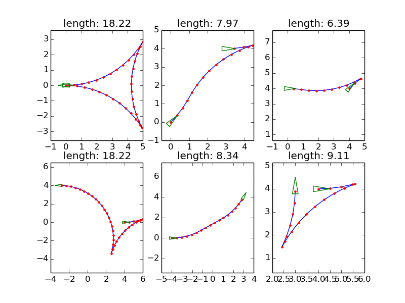

======
Reeds Shepp Path Library
======

|build_status|

Overview
======
The library implements the analytic Reeds Shepp path between two SE2 configurations. Reeds Sheep path [1]_ is defined as the shortest traveling path of the Reeds-Shepp Car, a car that can go both forward and backward with a constrained turning radius. Reeds-Sheep path can be viewed as a generalized version of `Dubins path <http://planning.cs.uiuc.edu/node821.html>`_.

The primary C++ source code comes from `Open Motion Planning Library <http://ompl.kavrakilab.org/ReedsSheppStateSpace_8cpp_source.html>`_ (OMPL). And the API of Python version (primarily a Cython wrapper) is similar to the `Dubins library <https://github.com/AndrewWalker/pydubins>`_ from Andrew Walker. 

More descriptions can be referred to the `OMPL <http://ompl.kavrakilab.org/2012/03/18/geometric-planning-for-car-like-vehicles.html>`_ and section 15.3.2 of the book `Planning Algorithms <http://planning.cs.uiuc.edu/node822.html>`_. 

Installation
======

Install from source 

.. code-block:: console

    $ sudo python setup.py install

Demo
======

.. code-block:: console

	$ python demos/demo.py

API
======

- path_length( q0, q1, turning_radius)

  - return total length of Reed Shepps curve from q0 to q1 with specified turning radius

- path_sample( q0, q1, turning_radius, step_size)

  - return list of tuple (x,y,theta) uniformly sampled from corresponding Reed Shepps curve

- path_type( q0, q1, turning_radius)

  - return the tuple of path segment type for the Reed Sheps curve from q0 to q1 with specified turning radius

TODO
======
* PyPI install

* cpp/python demo

References
======

.. [1] Reeds, J., & Shepp, L. (1990). Optimal paths for a car that goes both forwards and backwards. Pacific journal of mathematics, 145(2), 367-393.

.. |build_status| image:: https://secure.travis-ci.org/ghliu/pyReedsShepp.png?branch=master
   :target: https://travis-ci.org/ghliu/pyReedsShepp
   :alt: Current build status